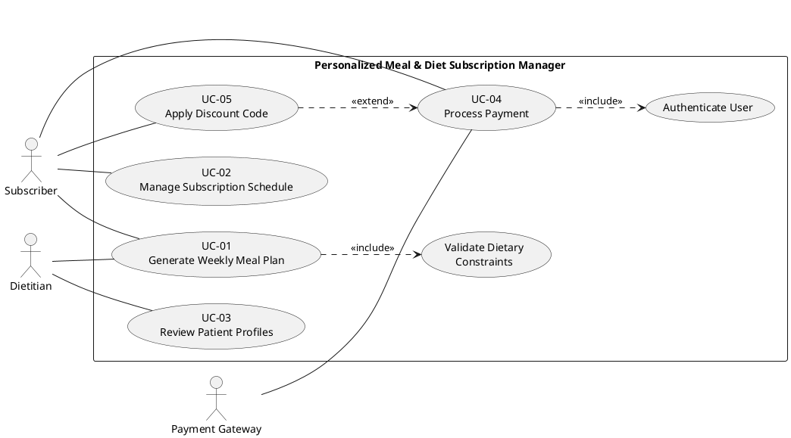

# Software Engineering Lab 1 - Requirements Engineering & UML Use-Case Modelling

**Problem Statement #19:** Healthcare & Telemedicine - Personalized Meal & Diet Subscription Manager  
**Student Name:** Harivasan R  
**SRN:** PES1UG24CS572

### Part 1: Requirements Table

| Req ID | Type | Description | Priority | Acceptance Criteria | Rationale |
|---|---|---|---|---|---|
| FR-001 | Functional | The system shall generate weekly meal plans strictly adhering to user macro-nutrient constraints and allergen exclusion lists. | High | **Pass:** Generated menu contains zero excluded allergen ingredients and each meal plan's calculated calories, protein, carbohydrates, and fat fall within the saved profile limits. **Fail:** Peanuts included for peanut-allergic profile, or any macro-nutrient limit is exceeded. | Core dietary safety. |
| FR-002 | Functional | The system shall allow a Dietitian to review, modify, and approve patient-specific metabolic constraints and meal plans. | High | **Pass:** An authorised Dietitian can view a subscriber profile, edit metabolic constraints or meal selections, record an approval, and the revised approved plan is visible to the subscriber. **Fail:** An unauthorised user can approve a plan, or an approved revision is not saved. | Professional review ensures that plans remain clinically appropriate for each patient. |
| FR-003 | Functional | The system shall allow subscribers to pause, skip, or reschedule daily meal deliveries. | Medium | **Pass:** An authenticated subscriber can select pause, skip, or a valid new delivery date; the system shows the revised schedule before confirmation and stores the selected action when it is at least 12 hours before dispatch. **Fail:** A valid eligible change is not persisted or is reflected incorrectly in the schedule. | Gives subscribers practical control over deliveries and helps reduce waste. |
| FR-004 | Functional | The system shall track and log daily meal delivery fulfillment status in real-time. | Medium | **Pass:** For each scheduled delivery, the system records status transitions (for example, Prepared, Out for Delivery, Delivered, or Failed) with a timestamp and displays the latest status to the subscriber. **Fail:** A status update is missing, out of sequence, or not visible after the delivery provider reports it. | Provides delivery visibility, supports issue resolution, and creates an auditable fulfillment record. |
| FR-005 | Functional | The system shall allow subscribers to rate delivered meals and provide feedback to dietitians. | Low | **Pass:** After a delivery is marked Delivered, the subscriber can submit a 1-5 rating and written feedback; the feedback is linked to that meal and visible to the assigned Dietitian. **Fail:** Feedback can be submitted for an undelivered meal or is not available to the Dietitian. | Feedback enables continuous improvement of meal quality and personalisation. |
| NFR-001 | Performance & Security | The subscription engine must support schedule modifications (pause, skip, reschedule) up to 12 hours before dispatch. | High | **Pass:** Benchmarking tests confirm target latency under simulated peak load, and every request at least 12 hours before the recorded dispatch time is evaluated against the cutoff and processed successfully. **Fail:** Eligible changes are rejected, ineligible changes are accepted, or peak-load testing exceeds the defined service target. | Ensures logistics reliability. |
| NFR-002 | Security & Compliance | All patient metabolic constraints and personal health data must be encrypted at rest and in transit compliant with data privacy standards. | High | **Pass:** Security verification confirms TLS 1.2 or higher for data in transit, industry-standard encryption for stored health data, and no sensitive patient data in application logs or unencrypted backups. **Fail:** A vulnerability scan or configuration review identifies unencrypted personal health data or an insecure transmission path. | Protects sensitive health information and supports privacy and regulatory compliance. |

### Part 2: Use-Case Flow Specification

**Use Case ID & Title:** UC-02 - Manage Subscription Schedule

**Primary Actor:** Subscriber  
**Supporting Systems:** Subscription Manager, Delivery Scheduling Service, Notification Service

**Goal:** Allow a subscriber to pause the subscription, skip a scheduled daily meal delivery, or reschedule an eligible delivery before operational dispatch.

**Preconditions:**

1. The subscriber has an active account and is authenticated.
2. The subscriber has an active meal subscription with at least one future scheduled delivery.
3. Each delivery record has a dispatch date and time stored by the Delivery Scheduling Service.
4. The Subscription Manager can access the current subscription schedule and the Delivery Scheduling Service.

**Postconditions:**

1. On success, the selected pause, skip, or reschedule action is validated and saved against the subscription or affected delivery record.
2. The revised delivery schedule is available on the subscriber dashboard and to the fulfillment team.
3. The system creates an audit record containing the subscriber, action, affected delivery, timestamp, and before/after schedule values.
4. The subscriber receives an on-screen confirmation and a notification of the final schedule.
5. If the request is rejected, the existing schedule remains unchanged and the subscriber is informed of the reason.

**Main Success Scenario:**

1. The subscriber signs in and opens the **Subscriber Dashboard**.
2. The system retrieves the subscriber's active subscription, current delivery schedule, and the next dispatch deadline from the backend database.
3. The dashboard displays upcoming daily deliveries, their planned dates, current statuses, and the available **Pause**, **Skip**, and **Reschedule** actions.
4. The subscriber selects a specific upcoming delivery, or selects the subscription-level pause option.
5. The system displays the selected delivery details, the applicable dispatch time, the 12-hour modification cutoff, and valid rescheduling dates.
6. The subscriber chooses one modification: pause the subscription for a defined period, skip the selected delivery, or reschedule it to an available date.
7. The subscriber enters any required details, such as pause start/end dates or the new delivery date, and selects **Review Changes**.
8. The system validates that the request is complete, that the account is authorised to change the subscription, and that the requested new date is within the delivery service's supported schedule.
9. The system compares the current server time with the recorded dispatch time and confirms that the request is at least 12 hours before dispatch.
10. The system shows a summary of the requested change, including the affected deliveries and any change in subscription status; the subscriber selects **Confirm**.
11. The Subscription Manager sends the approved change to the Delivery Scheduling Service and updates the subscription and delivery records in the backend database in one transaction.
12. The system writes an audit-log entry with the old schedule, new schedule, action type, subscriber identifier, and timestamp.
13. The Delivery Scheduling Service refreshes its fulfillment queue so that the paused, skipped, or rescheduled delivery is not dispatched on the previous date.
14. The Notification Service sends the subscriber an in-app and email/SMS confirmation containing the final updated schedule.
15. The dashboard refreshes and displays the updated delivery schedule and confirmation message. The use case ends successfully.

**Alternate Flow - A1: Modification Attempted Within the 12-Hour Cutoff Window**

1. At Step 9, the system determines that the current time is less than 12 hours before the selected delivery's dispatch time.
2. The system does not submit the modification to the Delivery Scheduling Service and does not update the backend database.
3. The system displays a clear message stating that the delivery is already inside the 12-hour operational cutoff and therefore cannot be changed online.
4. The system retains and displays the existing schedule, together with the next eligible delivery that may be paused, skipped, or rescheduled.
5. The system records the rejected attempt in the audit log with reason code `CUTOFF_WINDOW_EXCEEDED`.
6. The subscriber may return to the dashboard or contact support; the use case ends without modifying the selected delivery.

### Part 3: PlantUML Code for the Use-Case Diagram

